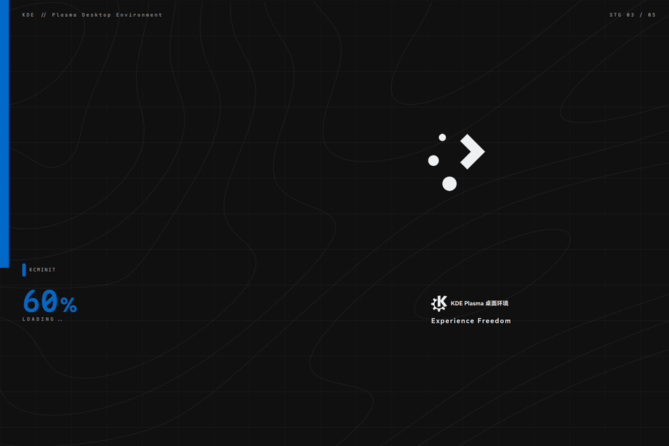
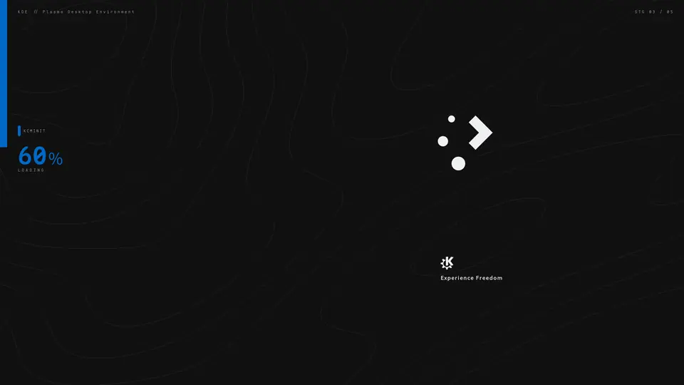

# Ark: Endfield Page Loading

[中文版](README.zh-CN.md)


A Plasma 6 splash screen theme with an industrial dark look: a top-down progress rail on the left edge, and a brand-blue full-screen wipe exiting to the desktop once loading completes.





## Install

```bash
bash install.sh
```

Then open **System Settings → Splash Screen**, select "Ark: Endfield Page Loading" → Apply. Log out and back in to see it live.

Rollback: just re-select your previous theme on the same page (the script never touches your `~/.config/ksplashrc` choice).

## Layout

- **Left**: 20px top-down progress rail; tick + percentage + current stage name ride the fill tip, driven by the real ksplash stage (1→20% … 5→100%)
- **Right**: Plasma gear mark (64% / 30% poster placement)
- **Bottom-right micro composition**: stock Breeze credit line + `Experience Freedom`, aligned with the official Endfield site loading page
- **Background**: grid + baked vector contour base

## Customize

- **Palette**: edit `palette` at the top of `contents/splash/Splash.qml` — `kde` brand blue `#0068C6` (default) / `valley` valley yellow `#fff500` / `wuling` Wuling teal `#14d0d0` / `system` follows the system accent color
- **Bottom-right copy**: the `Experience Freedom` line; do not change the Breeze credit line's catalog/context/source or it detaches from the official translations
- **Contour base**: re-bake with `python3 tools/make_contours.py` (marching squares → SVGZ vector)

## File structure

```
ark-endfield-loading/
├── metadata.json            # Plasma 6 package description (Id = directory name)
├── contents/
│   ├── splash/Splash.qml    # Theme body
│   ├── splash/images/       # contours.svgz (self-baked) + plasma/kde marks from Breeze
│   ├── previews/splash.png  # Settings thumbnail
│   └── defaults             # ksplash pointer for global-theme switching
├── preview-demo.webp        # Animated demo (real offscreen render, see above)
├── tools/make_contours.py   # Contour base baking script
├── .github/workflows/       # Tag-triggered store-package build attached to Releases
├── install.sh               # One-step install into the user theme directory
├── dist.sh                  # Build the store package (metadata.json + contents/ only)
└── LICENSE                  # GPL-2.0-or-later full text
```

Local-only extras, not committed: `docs/` (dev notes), offscreen capture tools, `dist/` artifacts.

## License & credits

- Theme code GPL-2.0-or-later; `plasma.svgz` / `kde.svgz` taken from Breeze (same license)
- Design language references [dsh-theme-endfield](https://github.com/ymh0000123/dsh-theme-endfield) and the official Endfield site loading page (original implementation, no official assets used)
